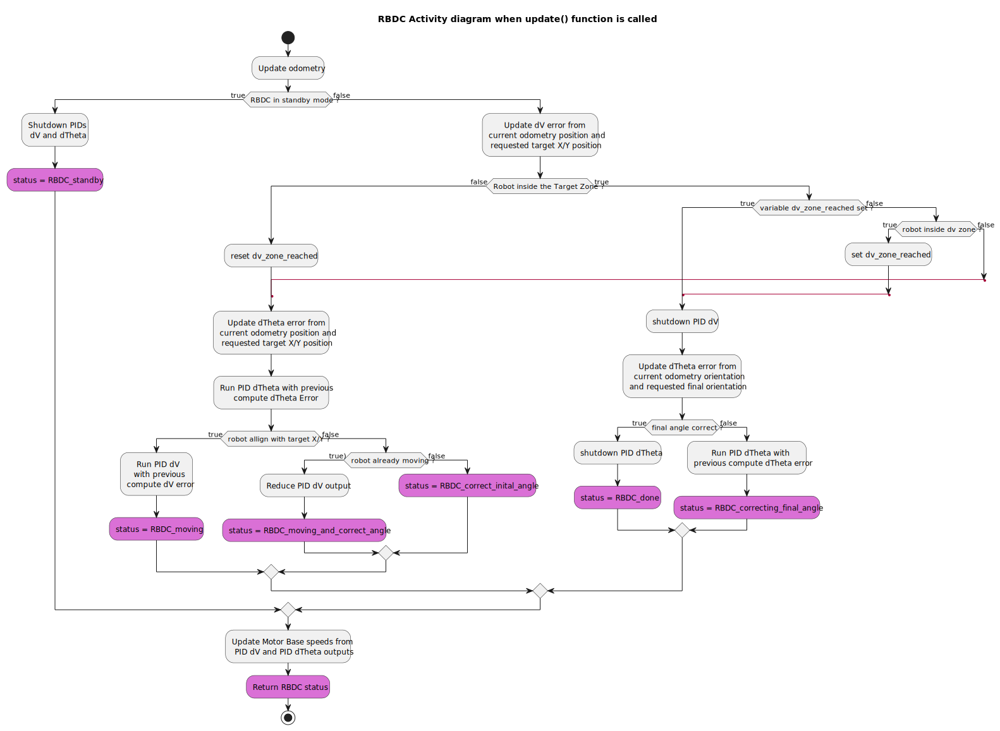
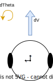

# RBDC 6TRON Library

## *Robot Base Drive Control*

## Introduction

The RBDC library aims to implement a simple robot behavior, to drive any motor base to a target position (X, Y, Theta).

## Implementation

The RBDC is written in C++, and not related to a particular framework. It will need however two other core libraries to work, Odometry and MotorBase (see below).

It's writing has been improved to keep as a goal the implementation on microcontroller (MCU), like STM32. But it needs some basic requirements.

## Requirement

The library itself has few requirements:

* `stdint.h`

* `math.h`

* strongly recommended: an [FPU](https://www.wikiwand.com/en/Floating-point_unit) (available on most MCU nowadays)

Additionally, the RBDC depends on two other external classes:

* [**Odometry**](https://github.com/catie-aq/6tron_odometry), to get current robot base info (like the actual position measured by sensors)

* [**MobileBase**](https://github.com/catie-aq/6tron_mobile-base), to send speeds commands to the base.

Theses two classes are defined as **interfaces**, this means that the user has to define its own child classes for its own application. An example of a custom implementation [can be found here](https://github.com/catie-aq/mbed_RBDC-pokibot-example).

## Behavior



The RBDC is working with two PIDs for two wheels robots, and three PIDs for omnidirectional robots:

* One PID for linear movement (dV)

* One PID for rotation movement (dTheta)

* TODO: for holonome robots, an additional PID for tangential movement (dTan)

Below are movements disposition for a two wheel-based robot :



The RBDC is updated at a fix user-defined rate (e.g. 50Hz or 1kHz). At each update, it doing multiple checks, explained in detail in the RBDC activity diagram above. But, to keep it simple here an example **for a two-wheeled robot**:

Robot is at [0m;0m;0°] and need to go to [2m;2m;0°]

* First, the RBDC check if the robot already is inside the target zone: not in this case.

* Then, because the robot is not aligned with the target, the RBDC will first rotate the robot to be aligned with the goal (using dTheta PID) : In our case, π/4 rad.

* Next, the robot will move to the target, and check alignment at the same time (using both dV and dTheta PIDs) : moving for 2.8m.

* The robot is now in the target zone. But before doing the final rotation, the RBDC will need to move as close as possible to the center of the target zone : the "dv precision zone".
  
  > Why are we doing this: we want simple movement for the robot. But, because of the nature of a two-wheels robot, we can't move to a tangential movement. So, when reaching the target zone, we cut the dV PID to do the rotation.
  > 
  > But, by doing so, and while doing the final rotation, the robot could "slide" out the target zone. This will trigger the RBDC to move again into the target zone, and that could stick the behavior into a loop.
  > 
  > By adding a second zone, smaller than the target zone, this will ensure that RBDC can safely rotate in the target zone, without fearing to slide out. So while inside the target zone, the two wheel robot continue to move a bit further before turning off dV and doing the final rotation.
  > 
  > For an holonome robot, this process will be much simpler, because all three of PIDs can be updated at the same time.

* Finally, the robot being as close as possible to the target, it can rotate to the target angle : 0°.

## Setup and how to use

To get the RBDC working correctly, there is some setup to do:

* The Odometry

* The Mobile Base

* The RBDC configuration

### Odometry

The user must create an Odometry class that respect the form and functions used by the RBDC. To do so, [an interface has been made](https://github.com/catie-aq/6tron_odometry), that forces the user to respect all features needed by the algorithm.

This class is needed to get the actual **X**, **Y** and **Theta** of the robot. The user is free to implement this the way he wants, using for example external encoders, or even a lidar.

In the case of a classical two wheels robot, with two sensors for each wheel (motor or external), [a child's class has already been made](https://github.com/catie-aq/6tron_odometry/blob/main/src/odometry_two_encoders.cpp) to get the implementation easier for the user.

An example of a custom application-specific odometry implementation can be found in the [Mbed RBDC Pokibot demo repository](https://github.com/catie-aq/mbed_RBDC-pokibot-example).

More info can be found on the [Odometry repository](https://github.com/catie-aq/6tron_odometry).

### Mobile Base

The user must create a Mobile base class that respect the form and functions used by the RBDC. To do so, [an interface has been made](https://github.com/catie-aq/6tron_mobile-base), that forces the user to respect all features needed by the algorithm.

This class is needed to convert **dV**, **dTheta** and **dTan** speeds from RBDC to the actual motor commands of the robot base.

Again, in the case of a classical two wheels robot, so with only two motors, [a child's class has already been made](https://github.com/catie-aq/6tron_mobile-base/blob/main/src/mobile_base_differential.cpp) to get the implementation easier for the user.

An example of a custom application-specific odometry implementation can be found in the [Mbed RBDC Pokibot demo repository](https://github.com/catie-aq/mbed_RBDC-pokibot-example).

More info can be found on the [Mobile Base repository](https://github.com/catie-aq/6tron_mobile-base).

### RBDC configuration

The RBDC requires some parameters to work properly. All possible parameters can be found in `sixtron::RBDC_params` structure.

| Parameter                               | type                          | default value | Comment                                                                                                                                                                                                                                                                                          |
| --------------------------------------- | ----------------------------- | ------------- | ------------------------------------------------------------------------------------------------------------------------------------------------------------------------------------------------------------------------------------------------------------------------------------------------ |
| `rbdc_format`                           | enum                          | two_wheels    | WIP: set the behavior of the RBDC. (basically, can we use dTan or not)                                                                                                                                                                                                                           |
| `pid_param_dv`<br/>`pid_param_dteta`    | PID parameters                | n/a           | These are the PID parameters. For more information, please check [6TRON PID repository](https://github.com/catie-aq/6tron_pid). <br/>Most important values to set for the RBDC are Kp, Ki, and Kd.<br/>Rate (dt_second) will be automatically setup by RBDC.                                     |
| `max_output_dtheta`<br/>`max_output_dv` | float [rad/s]<br/>float [m/s] | 1.0f          | These are the max output for each PID.<br/>A common practice is to have the dTheta PID output stonger than the dV PID output, thus the angle be corrected as quickly as possible when moving.                                                                                                    |
| `final_theta_precision`                 | float [rad]                   | 0.0f          | The angle precision (or range) used by the RBDC to consider that the correct value for target angle has been reached                                                                                                                                                                             |
| `moving_theta_precision`                | float [rad]                   | 0.0f          | The angle precision (or range) used by the RBDC when moving with PID dV. If this is exceeded, RBDC is put in a special mode to recover the trajectory. The user must set correctly this value, and not be too precise. For example, it can be 3 or 5 times the value of `final_theta_precision`. |
| `dv_reducing_coefficient`               | float                         | 0.80f         | When RBDC is trying to recover the trajectory, the reducing coefficient to apply to the PID dV output at each update.                                                                                                                                                                            |
| `target_precision`                      | float [m]                     | 0.5f          | The target zone around the target position. Consider it like a radius around the point.                                                                                                                                                                                                          |
| `dv_precision`                          | float [m]                     | 0.0f          | The dv precision zone. Must be smaller than `target_precision`. See explanation in "Behavior" part.                                                                                                                                                                                              |
| `dt_seconds`                            | float [s]                     | 0.0f          | The rate in seconds at which the RBDC will be called (eg 50Hz or 1kHz). RBDC will automatically setup this rate for his PIDs.                                                                                                                                                                    |
| `can_go_backward`                       | bool                          | true          | Can the robot go backward. This is useful only for two wheels robot.                                                                                                                                                                                                                             |

### C++ implementation (Pokibot example)

In user implementation, one must first create his own Odometry and MobileBase object in his initialisation code.

```cpp
    // Create odometry. Will be init by RBDC.
    odom = new sixtron::OdometryPokibot(hz_pid, sensorLeft, sensorRight);

    // Create robot mobile base. This will init all motors as well.  Will be init by RBDC.
    basePokibot = new sixtron::MobileBasePokibot(dt_pid, sensorLeft, sensorRight);
```

Then create and set RBDC parameters...

```cpp
    sixtron::RBDC_params rbdc_poki_params;

    rbdc_poki_params.rbdc_format = sixtron::RBDC_format::two_wheels_robot;
    rbdc_poki_params.max_output_dv = 0.2f;
    rbdc_poki_params.max_output_dtheta = 0.4f;
    rbdc_poki_params.can_go_backward = true;
    rbdc_poki_params.dt_seconds = dt_pid; //define before
    rbdc_poki_params.final_theta_precision = PID_TETA_PRECISION;
    rbdc_poki_params.moving_theta_precision = 3 * PID_TETA_PRECISION;
    rbdc_poki_params.target_precision = 2 * PID_DV_PRECISION;
    rbdc_poki_params.dv_precision = PID_DV_PRECISION;

    rbdc_poki_params.pid_param_dteta.Kp = 2.5f;
    rbdc_poki_params.pid_param_dteta.Ki = 0.001f;
    rbdc_poki_params.pid_param_dteta.Kd = 0.0f;

    rbdc_poki_params.pid_param_dv.Kp = 1.6f;
    rbdc_poki_params.pid_param_dv.Ki = 0.001f;
    rbdc_poki_params.pid_param_dv.Kd = 0.0f;
```

... and create the RBDC object.

```cpp
    rbdc_poki = new sixtron::RBDC(odom, basePokibot, rbdc_poki_params); // will init odom and robot base as well
```

Finally, in the control thread of the user code, or his while loop, the RBDC must be called at a regular interval.

```cpp
    sixtron::position target_pos;

    // Update Target
    target_pos.x = user_input_X;
    target_pos.y = user_input_Y;
    target_pos.theta = user_input_Theta;

    // set Target
    rbdc_poki->setTarget(target_pos);

    while (true) {
        // Wait for asserv tick, 1kHz
        controlThreadFlag.wait_any(CONTROL_THREAD_FLAG);

        // Update RBDC
        int rbdc_result = rbdc_poki->update();

        // Check if arrived on target
        if (rbdc_result == sixtron::RBDC_status::RBDC_done) {
            //do stuff, change target, printf, ....
        }

    );
```

### RBDC Status Output

At each update called, the RBDC output is current status.

Status enum list can be found in the behavior diagram, or [directly in the code](https://github.com/catie-aq/RBDC/blob/main/RBDC/RBDC.h#L27).

When RBDC is returning "RBDC_done", then the target has been reached.

## Enhancement

* Holonome implementation (need a third PID dTan ?)

* In the README:
  
  * Add images for each RBDC steps

* Considerate an even lighter library written in C, and not using floats. But this will be another repository.  (TIP)
